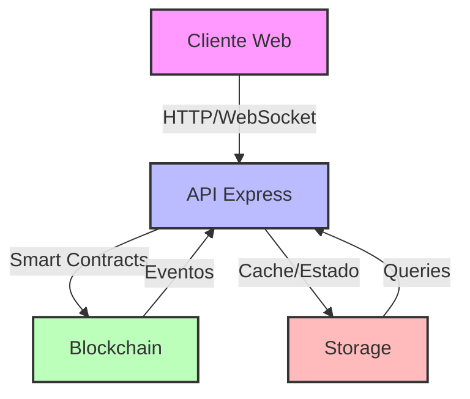
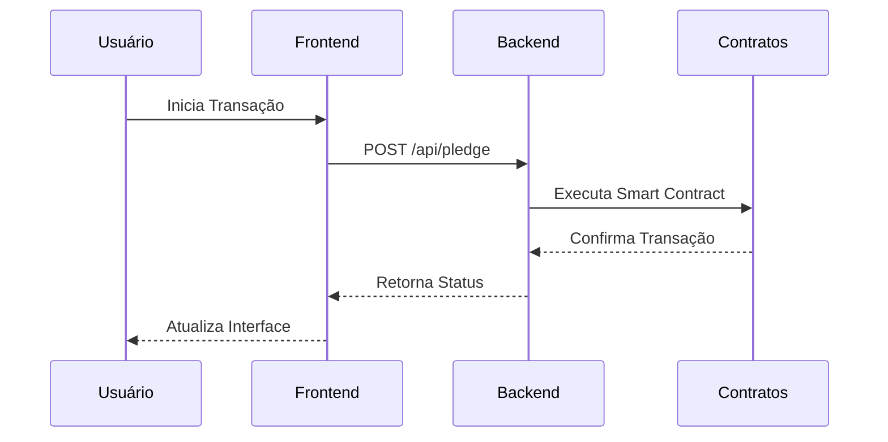
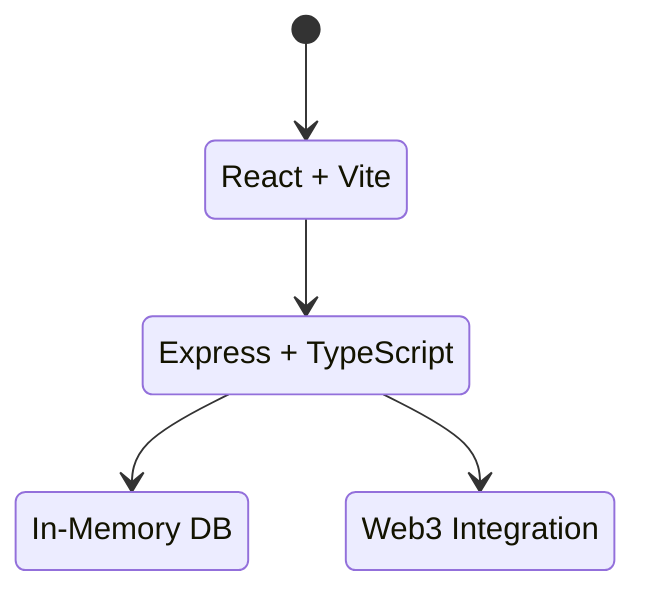

# TourChain - Plataforma Web3 de Viagens Corporativas

## Arquitetura do Sistema



## Fluxo de Transações



## Componentes do Sistema



## Logo SVG

<svg width="100" height="100" viewBox="0 0 100 100" xmlns="http://www.w3.org/2000/svg">
  <circle cx="50" cy="50" r="45" fill="#e0f2fe" stroke="#0ea5e9" stroke-width="2"/>
  <path d="M30,50 L70,50 M50,30 L50,70" stroke="#0ea5e9" stroke-width="4" stroke-linecap="round"/>
  <circle cx="50" cy="50" r="10" fill="#0ea5e9"/>
</svg>

## Tecnologias Utilizadas

- Frontend: React, Vite, TailwindCSS
- Backend: Express, TypeScript
- Blockchain: Web3.js
- Storage: In-Memory Database

## Estrutura do Projeto

```
├── client/           # Frontend React
├── server/           # Backend Express
└── shared/           # Tipos e schemas compartilhados
```

## Características Principais

- Integração Web3 completa
- Sistema de recompensas dinâmico
- Contratos inteligentes para transações
- Interface responsiva e moderna

## Como Executar

1. Instale as dependências:
```bash
npm install
```

2. Inicie o servidor de desenvolvimento:
```bash
npm run dev
```

3. Acesse `http://localhost:5000`

## Endpoints da API

- `POST /api/pledge` - Criar nova contribuição
- `GET /api/projects` - Listar projetos
- `GET /api/rewards` - Listar recompensas

## Licença

MIT
